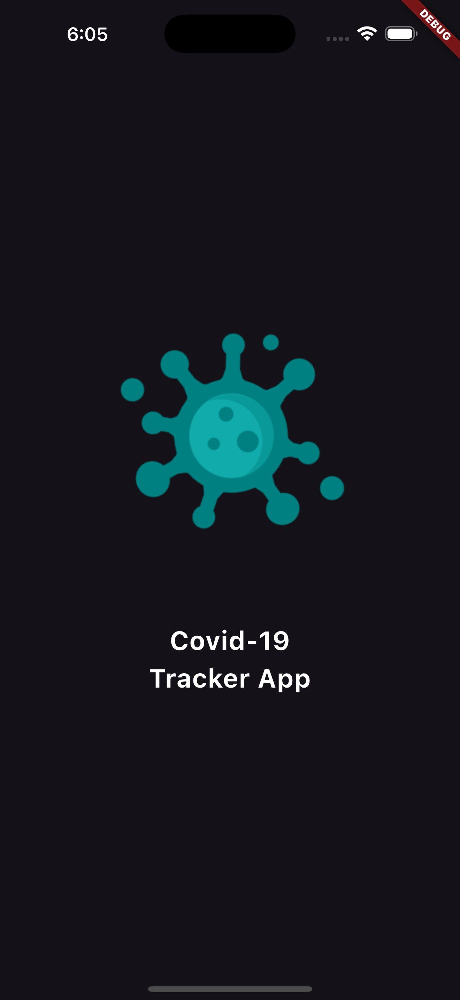
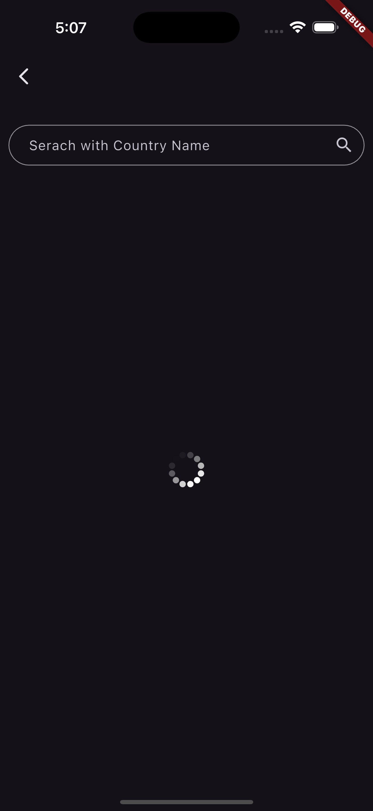
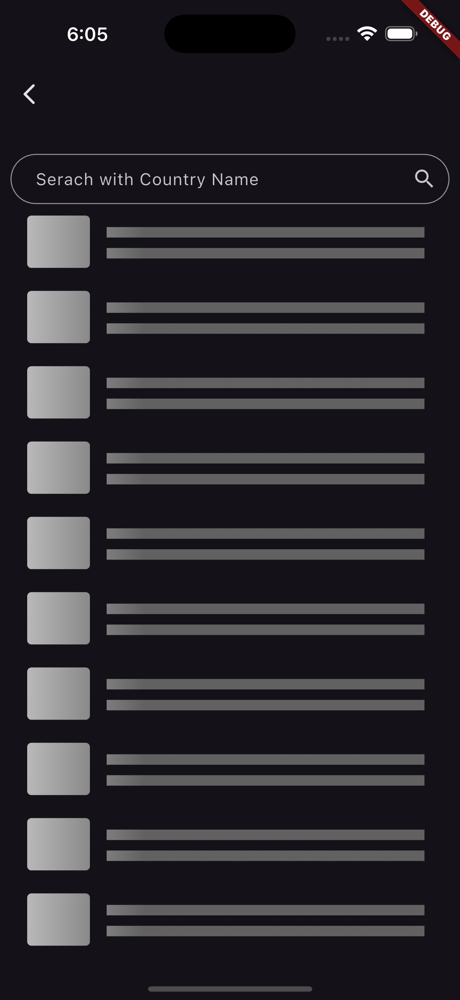

# 🌍 Covid Tracker App

A Flutter app that shows live COVID-19 data for all countries.

---

## 📱 Screenshots

<p align="center">
  
  
  
  
  
  
</p>

---

## 🚀 Features
- 🌐 Real-time COVID-19 API data
- 📊 Country-wise stats
- 🕵️ Search by country name
- 📈 Animated loading with `flutter_spinkit`

---

## 🛠️ Tech Stack
- Flutter 3.x
- Dart
- REST API (disease.sh)

---

## ⚙️ Getting Started
```bash
flutter pub get
flutter run
# flutter_-Covid-Tracker-App
